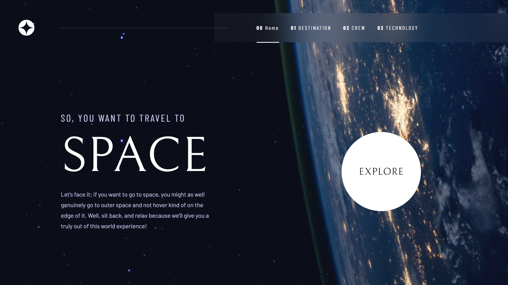
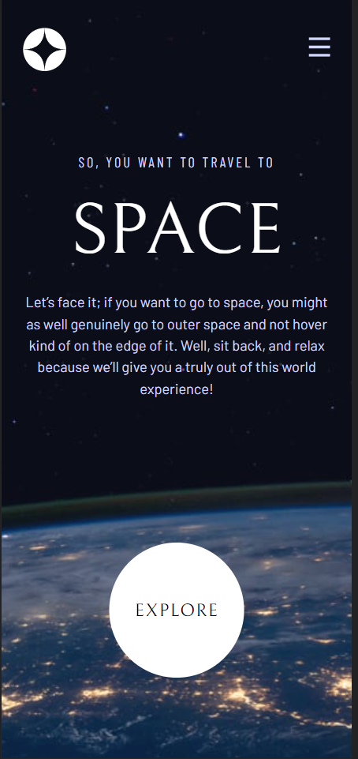

# Space Tourism Website - Frontend Mentor Challenge Solution

This is my solution to the [Space Tourism Website challenge on Frontend Mentor](https://www.frontendmentor.io/challenges/space-tourism-multipage-website-gRWj1URZ3). Frontend Mentor challenges are a great way to improve your coding skills by building realistic projects.

## Table of Contents

- [Overview](#overview)
  - [The Challenge](#the-challenge)
  - [Screenshot](#screenshot)
  - [Links](#links)
- [My Process](#my-process)
  - [Built With](#built-with)
  - [What I Learned](#what-i-learned)
  - [Continued Development](#continued-development)
  - [Useful Resources](#useful-resources)
- [Author](#author)
- [Acknowledgments](#acknowledgments)

## Overview

### The Challenge

In this challenge, I successfully completed the following tasks:

- Created a responsive design for the website to accommodate various screen sizes.
- Implemented hover states for interactive elements.
- Implemented dynamic routing to allow users to view different pages and toggle between tabs for new information.

### Screenshot

### Links

- [Solution URL](https://github.com/vashu-kashyap/space-tourism-website)
- [Live Site URL](https://space-tourism-website-azure.vercel.app/crew)

## My Process

### Built With

I built this project using the following technologies and techniques:

- Semantic HTML5 markup
- CSS custom properties (CSS variables)
- Flexbox and CSS Grid for layout
- Mobile-first development approach
- [React](https://reactjs.org/) - JavaScript library
- [Next.js](https://nextjs.org/) - React framework
- [Tailwind CSS](https://tailwindcss.com/) - Utility-first CSS framework for styles

### What I Learned

While working on this project, I gained valuable experience in the following areas:

- Dynamic routing in Next.js
- Deployment of a Next.js application on Vercel
- Building fully responsive web pages
- Rendering content dynamically based on user interactions

### Continued Development

In future projects, I plan to focus on the following areas for continued development:

- Further refining my responsive design skills
- Exploring advanced Next.js features
- Improving my code organization and maintainability

### Useful Resources

During this challenge, I found the following resources helpful:

- [Figma Design File](https://www.figma.com/community/file/1222868380190526431) - You can access the Figma design file I used for this project to help with the design and layout.

## Author

- Linktr.ee [Im.vashukashyap](https://linktr.ee/Im.vashukashyap)
- Linkedin - [@Im.vashukashyap](https://www.linkedin.com/in/im-vashukashyap/)
- Instagram - [@Im.vashukashyap](https://www.instagram.com/im.vashukashyap/)

## Acknowledgments

I would like to acknowledge any individuals or resources that contributed to the successful completion of this project. Whether it was inspiration from others' solutions or collaboration in a team, their contributions are greatly appreciated.
